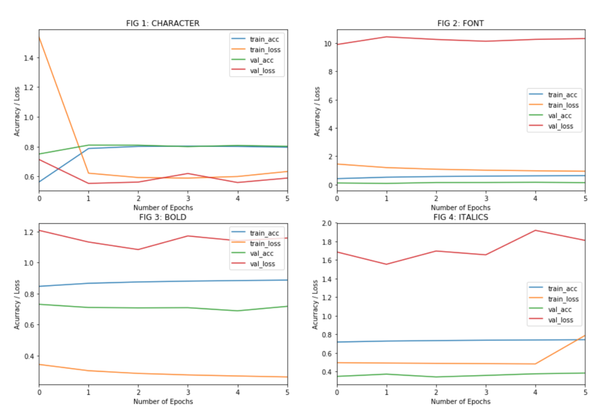

# OPTICAL CHARACTER RECOGNITION USING DEEP LEARNING

A sample project for implementation of optical character recognition system using Deep Learning (KEARAS).

## 1. INTRODUCTION

Artificial Neural Network and Deep Learning are the most robust and evolving machine learning algorithm known today with its immense capacity to accurately learn particular class of problems like image classification and recognition, speech recognition, and natural language processing. In this assignment we will deal with character recognition, a particular case of image recognition problem using Convolution Neural Networks (CNN). The CNN are special class of neural nets that performs mathematical convolution given a kernel function over the input data. CNN intuitively identifies the patterns in the input data and hence 2-dimensional CNN kernel can effectively and efficiently identify the features of the images.

## 2. TRAINING DATASET AND DATA AUGMENTATION

The model is expected to be able to classify images of characters of dimension (64, 64, 1) across 4 different labels, namely font, character, bold, and italics. We are considering 96 characters for 28 fonts with 11 font classes and varying font styles for bold and italic.
We leveraged existing python library **pillow** to generate training images for all the classes of characters and fonts. Using 2 font sizes across 96 characters and 28 fonts we generated 5264 base training images. Since this is inadequate number of sample data required to train a CNN model, we applied different data augmentation methods using **keras** and **opencv** library to perform rotation, horizontal and vertical translation, scaling, and blurring on base images with different augmentation factors to generate 130 variants of each base image.
This way we were able to generate 684320 data samples with corresponding class labels for training. A good illustration of transformations performed on one sample image (first image) can be observed in the figure below.

## 3. DESCRIPTION OF ANN MODEL

This model design is influenced by VGG convolutional model, a model proposed for ILSVRC-2014 competetion. The principal design idea behind the class of model is the performance of small-sized (3X3) stacked convolutional kernels which has same effective receptive field as CNN with bigger kernel sizes but with higher depth and non- linearity and low computation cost.  

It takes high volume of training data for deep CNN layers to converge and hence a learning technique called Transfer Learning is often used. In this technique weighted layers from a pre-trained model (trained on other similar image classification task) are used either as an initialization or a fixed feature extractor for the task in hand. We applied similar technique to train our models in multiple sessions.  

We used **keras** functional API and **tensorflow** package to build neural network. In first session of the training, a bolck of CNN layers paired with dense layers was trained to classify inputs to **char** classes. We achieved around 80% accuracy for the classification within first few epochs of training. We then added new convolutional and dense layer blocks on thus pretrained model layers for second training session, i.e. classifying input by **fonts**. The layers from the first model are frozen such that these weights are not updated and hence they work as feature extractor for newer layers. Lastly for the third session we added two parallel dense layer blocks on the top of the model from second session to perform classification for **bold** and **italic** labels.

## 4. MODEL PERFORMANCE ON TRAINING AND TEST DATA

The model was trained in three different sessions. Due to lack of adequate hardware for the computation, we test run the training for only 6 epochs and validation split to 20% of input data. First session involved training 11 layer model for character classification only.

As we can see in figure above, both training and validation accuracy converged to around 80% in second iteration but failed to yield better accuracy any further. In second training session, we froze the layers from first model and only trained newer layers for font classification. This new model however performed ineffectual with maximum training accuracy of 62% and validation accuracy of just 13%, a case of overfitting model. Moving onto the third session, bold style classifier has training accuracy of over 80% and validation accuracy of 70% while italic style classifier has bigger disparity with training accuracy at 74% while validation accuracy at 38%, this again being case of model overfitting on training data.

The training statistic falls off from the accuracy level we would consider good. To remedy the saturation of accuracy on training data, we tried to increase the complexity of the model by adding more hidden layers (convolution layers and dense layers) on the top of drop-out layers which we expected would prevent model from overfitting. Despite those changes, the model did not projected substantial gain in accuracy.

